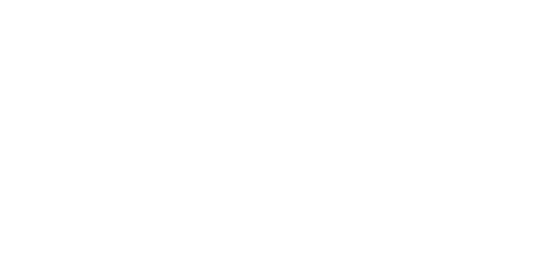

# SimpleRA

---

## Compilation Instructions

We use ```make``` to compile all the files and creste the server executable. To compile:


* ```cd``` into the SimpleRA directory

```sh

cd SimpleRA

```

* ```cd``` into the soure directory (called ```src```)

```sh

cd src

```

* To compile

```sh

make clean

make

```

---

## Overview

SimpleRA is a simplified relational database management system with support for integer tables and matrices.

---

## Important Features

- Relational Algebra Operators
- Integers Only
- No update operations
- No aggregate operations
- No nested queries
- No transaction management
- Single thread programming only
- No identifiers should have spaces in them

---

## Commands

There are 2 kinds of commands in this database.

- Assignment statements
- Non-assignment statements

<br>
  
---

## Non Assignment Statements

Non-assginment statements do not create a new table (except load which just loads an existing table) in the process.

- LOAD
- LIST
- PRINT
- ROTATE
- RENAME
- EXPORT
- CLEAR
- SOURCE
- LOAD MATRIX
- PRINT MATRIX
- EXPORT MATRIX
- CROSSTRANSPOSE
- CHECKANTISYM
- SORT
- INSERT
- DELETE
- UPDATE
- INDEX
- QUIT

---

### LOAD

Syntax:
```
LOAD <table_name>
```
- To successfully load a table, there should be a csv file names <table_name>.csv consisiting of comma-seperated integers in the data folder
- None of the columns in the data file should have the same name
- every cell in the table should have a value

Run: `LOAD A`

---

### LIST TABLES

Syntax
```
LIST TABLES
```
This command lists all tables that have been loaded or created using assignment statements

Run: `LIST TABLES`
Run: `LOAD B`, `LIST TABLES`

---

### PRINT

Syntax
```
PRINT <table_name>
```

- Displays the first PRINT_COUNT (global variable) rows of the table. 
- Less number of rows can be printed if the table has only a few rows

Run: `PRINT B`

---

### RENAME

Syntax
```
RENAME <toColumnName> TO <fromColumnName> FROM <table_name>
```

- Naturally <table_name> should be a loaded table in the system and <fromColumnName> should be an exsiting column in the table
- <toColumnName> should not be another column in the table

Run: `RENAME b TO c FROM B`

---

### EXPORT

Syntax
```
EXPORT <table_name>
```

- All changes made and new tables created, exist only within the system and will be deleted once execution ends (temp file)
- To keep changes made (RENAME and new tables), you have to export the table (data)

Run: `EXPORT B`

---

### CLEAR

Syntax
```
CLEAR <table_name>
```
- Removes table from system
- The table has to have previously existed in the system to remove it
- If you want to keep any of the changes you've made to an old table or want to keep the new table, make sure to export !

Run: `CLEAR B`

---

### QUIT

Syntax
```
QUIT
```

- Clear all tables present in the system (**_WITHOUT EXPORTING THEM_**)  (temp file - empty)

Run: `QUIT`

---

### SOURCE

- **Syntax**:

```
SOURCE <filename>
```

- Executes a script of queries from `<filename>.ra` located in the `/data` directory line by line.
- Does not directly create or read data blocks; it processes query strings.
- Checks for file existence. Errors in sourced commands are handled as if typed directly.

---

### LOAD MATRIX

Syntax:
```
LOAD MATRIX <matrixName>
```

- Loads an *_n×n_* matrix from `<matrixName>.csv` into memory. Determines dimension from line count and splits the matrix row by row into "pages" in `../data/temp/`.
- Stores as many full rows as possible in one page file. `maxRowsPerBlock` is based on `BLOCK_SIZE` and matrix dimension.
- Uses `bufferManager` to write each page to `../data/temp/<matrixName>_Page<i>`.
- Semantic errors if CSV doesn't exist, matrix already loaded, or CSV is malformed.

---

### PRINT MATRIX

Syntax
```
PRINT MATRIX <matrixName>
```

- Displays the first 20 rows (or fewer if matrix is smaller) and up to 20 columns of the specified matrix.
- Reads matrix stored as blocks of full rows.
- Error if matrix doesn't exist. Shows nothing if dimension is 0 or block reading fails.

---

### EXPORT MATRIX

Syntax
```
EXPORT MATRIX <matrixName>
```

- Writes the matrix from temporary page files to a persistent CSV file `../data/<matrixName>.csv`.
- Reads each block from `temp/` and writes line by line to the final CSV.
- Error if matrix doesn't exist or file can't be opened for writing.

---

### ROTATE

Syntax
```
ROTATE <matrixName>
```

- Rotates the specified matrix 90 degrees clockwise *_in place_*.
- Reads/writes cell by cell using `readMatrixElement()` and `writeMatrixElement()`, operating on block/page data in `temp/`.
- Semantic error if matrix not found or dimension is zero.

---

### CROSSTRANSPOSE

Syntax
```
CROSSTRANSPOSE <matrixName1> <matrixName2>
```

- Transposes `<matrixName1>` in place, transposes `<matrixName2>` in place, then swaps the contents of the two matrices cell by cell.
- Uses cell-by-cell fetch and update via `readMatrixElement()` and `writeMatrixElement()`.
- Semantic error if dimensions differ or a matrix is missing.

---

### CHECKANTISYM

Syntax
```
CHECKANTISYM <matrixName1> <matrixName2>
```

- Checks if `matrixName1` = −( `matrixName2` )<sup>T</sup>. Prints "True" or "False".
- Uses cell-by-cell reads. No writes.
- Semantic error if matrices are missing or dimensions differ. Returns "False" on data mismatch.

---

### SORT

Syntax
```
SORT <table-name> BY <col1>,<col2>,<col3> IN <ASC|DESC>,<ASC|DESC>,<ASC|DESC>
```

- Sorts `<table-name>` in-place based on specified columns and directions using a two-phase external merge sort (10-block memory constraint).
- Adheres to 10-block limit. Phase 1 creates sorted runs (chunks of <=10 blocks). Phase 2 merges runs (<=9 input, 1 output).
- Syntax errors for invalid structure/direction. Semantic errors for non-existent table/columns. Cleans up temp files on error.

---

### INDEX

Syntax 
```
INDEX ON <column_name> FROM <table_name> USING BTREE
```
- Creates a B+ Tree index on `column_name` for `table_name`.
- B+ Tree consists of internal and leaf nodes. Nodes stored as separate files (`<indexName>_Node<pageIndex>`). Node I/O is direct (not via BufferManager). Operations include build, insert, delete (with underflow handling via borrow/merge for leaves, stubs for internal), search.
- ***Why B+ Tree***: Efficient disk I/O, supports range queries, balanced.
- ***Assumptions***: Index nodes use direct file I/O. Keys are integers. Order calculated based on `BLOCK_SIZE`. Single-user environment. Index not persistent between runs.
---

### INSERT

Syntax 
```
INSERT INTO table_name ( col1 = val1, col2 = val2, ... )
```

- Inserts a new row into the specified table. Identifies the target data page (typically last, or new if last is full). Modifies at most one data page.
- If table is indexed on a column, updates the B+ Tree index by inserting the new key and `RecordPointer`.
- Avoids full table rewrites. Logarithmic insertion into index tree.

---

### DELETE

Syntax 
```
DELETE FROM table_name WHERE column_name binary_operator value
```

- Deletes rows matching the `WHERE` clause. Uses index lookup if condition is `==` on an indexed column; otherwise, performs a table scan. Rows are removed by rewriting affected pages.
- If table is indexed, corresponding keys are deleted from the B+ Tree for each deleted row.
- Leverages index for `==` conditions. Modifies only affected data pages. Logarithmic deletions from index.

---

### UPDATE

Syntax 
```
UPDATE table_name WHERE condition SET column_name = value` (Note: `WHERE` precedes `SET`)
```

- Modifies rows matching the `WHERE` clause by setting `column_name` to `value`. Uses index for `WHERE` lookup if `==` on indexed column; otherwise, table scan. Affected pages are rewritten.
- If the updated column is the indexed column and its value changed, the old key is deleted and the new key is inserted into the B+ Tree.
- Uses index for `WHERE` lookup when possible. Modifies only affected pages. Conditional, logarithmic index updates.


---

## Assignment Statements

All assignment statements lead to the creation of a new table. 

Every statement is of the form ```<new_table_name> <- <assignment_statement>```, where `<new_table_name>` shouldn't already exist in the system

- CROSS
- PROJECTION
- SELECTION
- ORDERBY
- GROUPBY
- PARTITION HASH JOIN
- SEARCH

---

### CROSS

Syntax
```
<new_table_name> <- CROSS <table_name1> <table_name2>
```

- Both the tables being crossed should exist in the system
- If there are columns with the same names in the two tables, the columns are indexed with the table name. If both tables being crossed are the same, table names are indexed with '1' and '2'

---

### PROJECTION

Syntax
```
<new_table_name> <- PROJECT <column1>(,<columnN>)* FROM <table_name>
```

- naturally all columns should be present in the original table

---

### SELECTION

Syntax
```
<new_table_name> <- SELECT <condition> FROM <table_name>
```

Where `<condition>` is of either form
```
<first_column_name> <bin_op> <second_column_name>
<first_column_name> <bin_op> <int_literal>
```

And where `<bin_op>` can be any operator among {>, <, >=, <=, =>, =<, ==, !=}

The selection command only takes one condition at a time.

---

### ORDERBY

Syntax
```
<newTable> <- ORDER BY <columnName> ASC|DESC ON <existingTable>
```

- Creates `<newTable>` by sorting `<existingTable>` based on `<columnName>` and direction (ASC/DESC). Uses in-memory sort.
- Loads all rows from source table into memory, sorts, then writes to `<newTable>` and blockifies it.
- Semantic errors if source table missing, new table exists, or column invalid. Syntax error for invalid direction. Potential out-of-memory for very large tables.

---

### GROUPBY

Syntax

```
<resultTable> <- GROUP BY <attribute1>

FROM <table>

HAVING <Aggregate-Func1(attribute2)> <bin-op> <attribute-value>

RETURN <Aggregate-Func2(attribute3)>
```

- Groups rows from `<table>` by `<attribute1>`, filters groups using `HAVING` clause, and computes aggregate `<Aggregate-Func2(attribute3)>` for qualifying groups, storing result in `<resultTable>`.
- Sorts input table on grouping attribute first. Processes sorted table in a streaming fashion (one page at a time) to identify groups and compute aggregates.
- Syntax errors for malformed query. Semantic errors for table/column issues. Handles empty result sets.

---

### PARTITION HASH JOIN

Syntax
```
<newTableName> <- JOIN <table1>, <table2> ON <column1> == <column2>
```

- Performs an EQUI-JOIN of `<table1>` and `<table2>` on `<column1> == <column2>` using a two-phase partition hash join (10-block memory constraint). Only `==` operator is supported.
- Phase 1 partitions tables into buckets. Phase 2 loads one bucket of `<table1>` into a hash table, then probes with corresponding bucket of `<table2>`.
- Syntax error for non-`==` operators. Semantic errors for table/column issues.

---

### SEARCH

Syntax 
```
R <- SEARCH FROM T WHERE col bin_op literal
```

- Selects rows from table `T` where `col bin_op literal` is true, storing result in `R`. ***Always**** uses a B+ Tree index on `col`. If index doesn't exist, it implicitly creates one. Aborts if index creation fails.
- ***Supported Operators****: `==`, `<`, `>`, `<=`, `>=`, `!=`.
- Uses existing or implicitly created B+ Tree index for all search operations (e.g., `searchKey`, `searchRange`).
- Logarithmic time for finding row pointers via index. Implicit index creation adds initial cost if not pre-built.
- Syntax/semantic errors. Aborts on implicit index creation failure. Handles invalid `RecordPointer`s.
---

### Internals

- Buffer Manager

- Cursors

- Tables

- Executors

---

### Command Execution Flow


Run: `LOAD A` with debugger

see: load.cpp

---

### Syntactic Parser

- Splits the query into query units

see: syntacticParser.h syntacticParser.cpp

### Semantic Parser

- Makes sure your query makes semantic sense

see: semanticParser.h semanticParser.cpp

---

### Executors

Every command(COMMAND) has a file in the executors directory, within that directory you'll find 3 functions

```
syntacticParseCOMMAND
semanticParseCOMMAND
executeCOMMAND
```

---

### Buffer Manager

- Load splits and stores the table into blocks. For this we utilise the Buffer Manager

- Buffer Manager follows a FIFO paradigm. Essentially a queue

---

### Table Catalogue

- The table catalogue is an index of tables currently loaded into the system

---

### Cursors

A cursor is an object that acts like a pointer in a table. To read from a table, you need to declare a cursor.



Run: `R <- SELECT a == 1 FROM A` with debugger

---

### Logger

Every function call is logged in file names "log"

---
